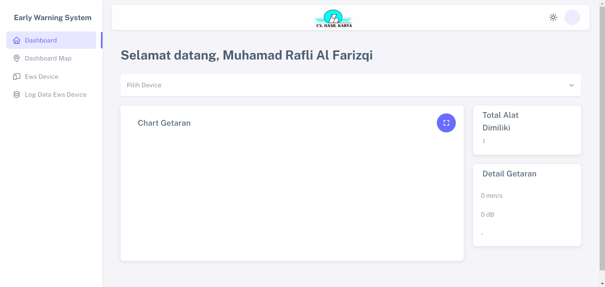
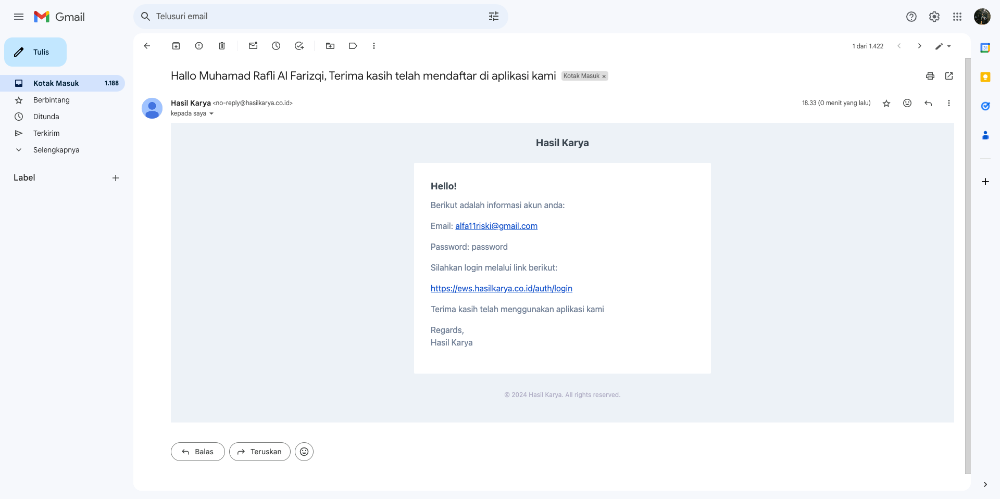
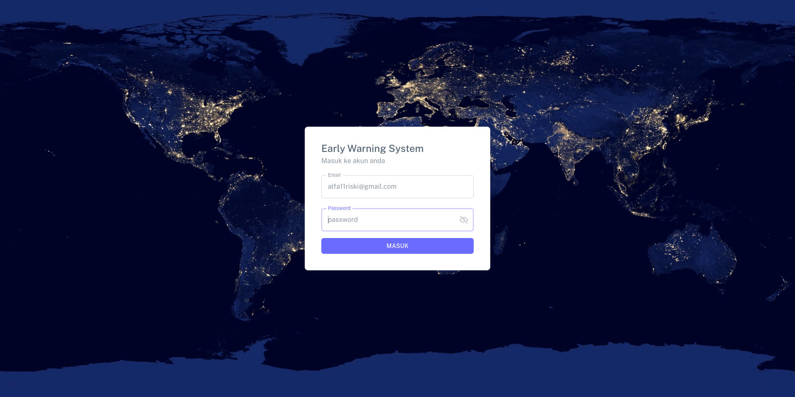
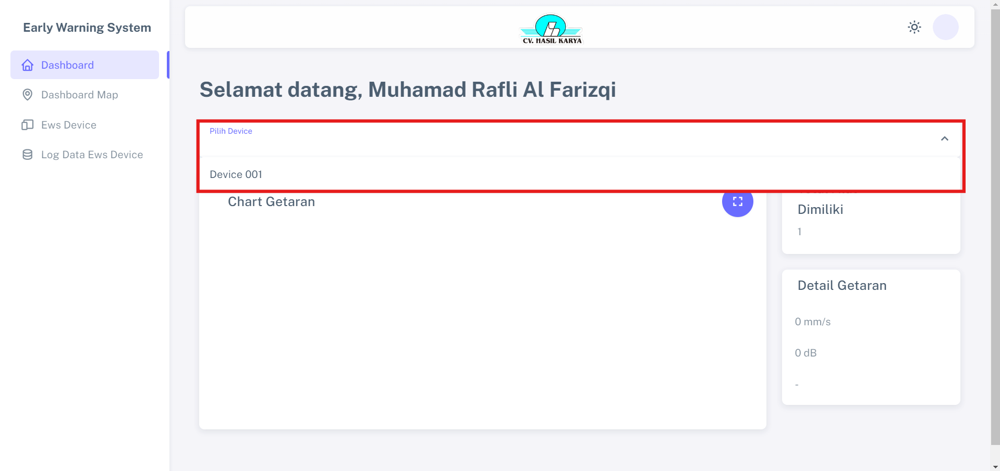
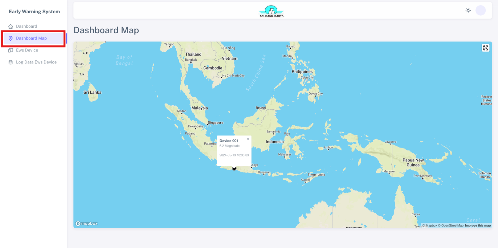
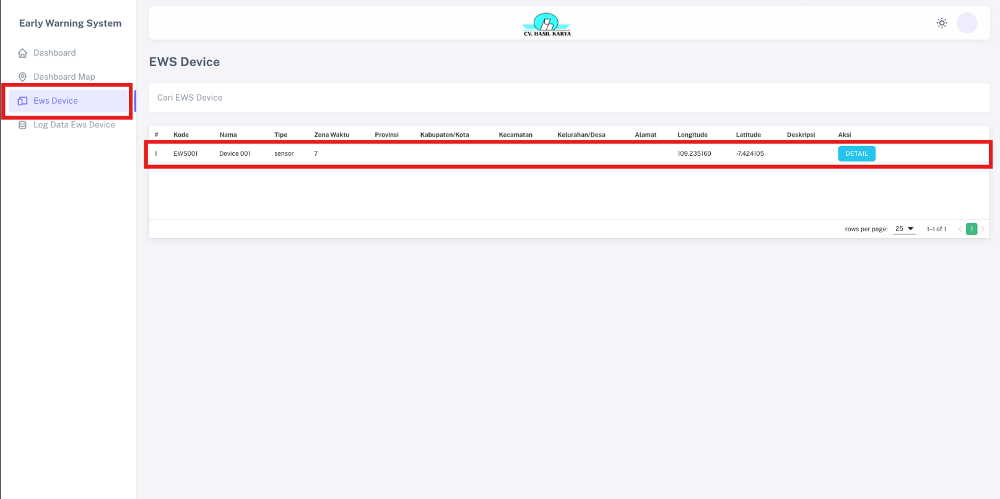
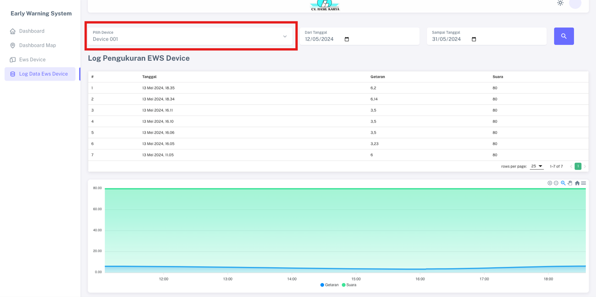

# Penggunaan EWS Sebagai Client

Penggunaan Early Warning System (EWS) pada client dapat dilakukan saat client menerima email dari hasilkarya.co.id yang berisi informasi akun yang telah dibuat oleh admin. Client mengandalkan satu perangkat EWS untuk mengakses dan mengelola semua data yang diterimanya. Dengan demikian, fitur-fitur yang tersedia dalam perangkat tersebut terfokus pada menampilkan data dari satu sumber EWS device yang dimiliki oleh client. Dengan penggunaan yang terfokus ini, client dapat dengan mudah mengakses dan merespons informasi yang diberikan oleh ews.hasilkarya.co.id mengenai perangkatnya ataupun informasi adanya gempa.

## Langkah-langkah Login  

1. Buka email dari hasilkarya.co.id.

2. Klik tautan yang dikirim dan masukkan email juga password.

## Langkah-langkah Melihat Perkembangan 

1. Pilih device yang dimiliki pada menu "Pilih Device" pada halaman dashboard.

## Langkah Melihat Klasifikasi Gempa

1. Klik titik koordinat device pada menu "Dashboard Map".

## Langkah Melihat EWS Device

1. Klik "EWS Device" pada menu dan tertera hanya ada satu device pada tabel.

## Langkah-langkah Mendapatkan Data Pengukuran

1. Klik "Pilih Device" dan pilih device yang dimiliki juga tanggal pada menu "Log Data EWS Device" dengan standar tampilan defaultnya rentang satu bulan.

