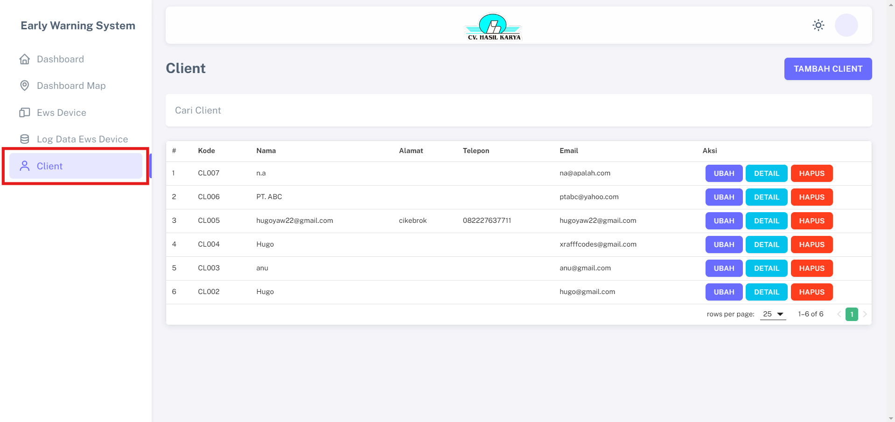
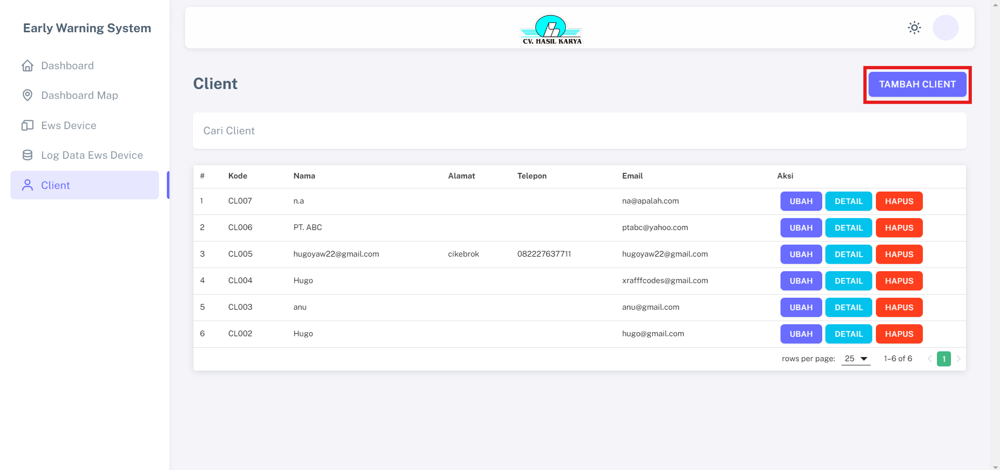
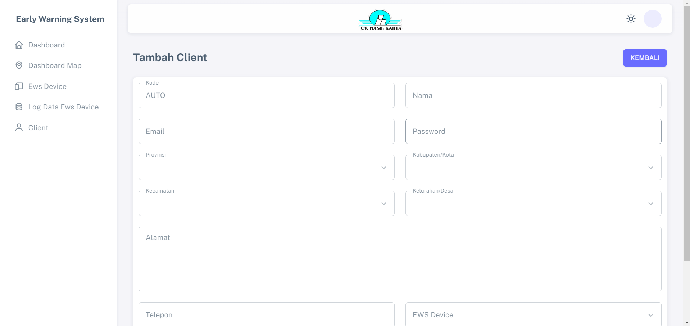

# Client

Fitur "Client" menampilkan seluruh data secara detail tentang client, dan diidentifikasi oleh kode identitas unik yang berbeda untuk setiap client.

 

## Langkah-langkah Tambah Client

1. Klik menu "TAMBAH CLIENT" pada halaman dahsboard.

2. Lengkapi semua data yang diperlukan dan simpan.                 

