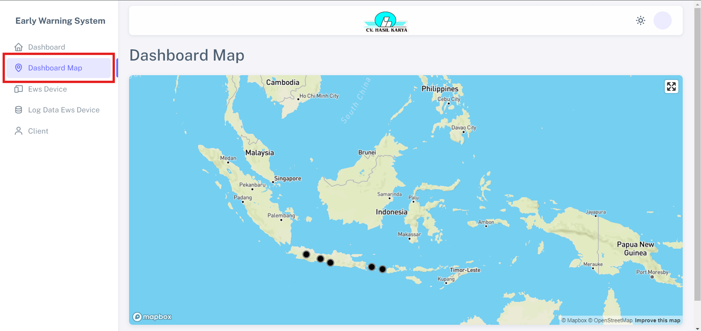
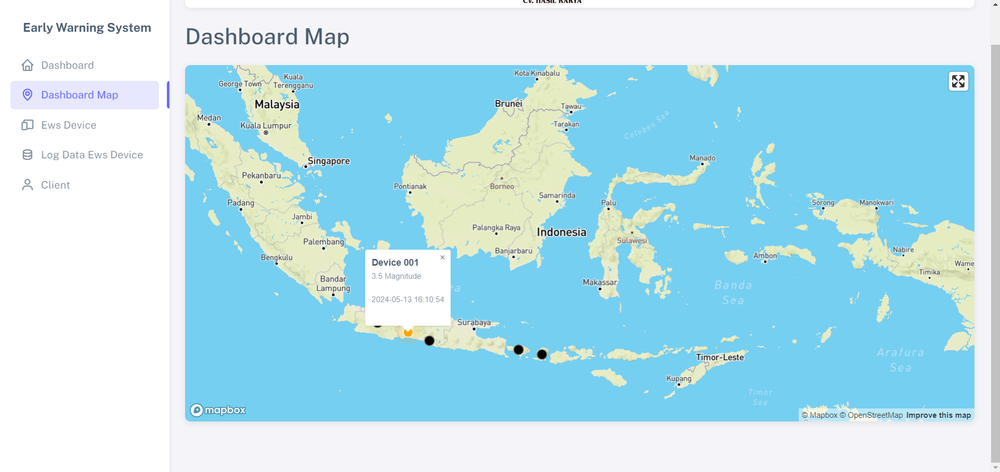

# Dashboard Map

Fitur "Dashboard Map" memberikan kemudahan pengguna untuk melihat perkembangan data secara real-time dalam bentuk peta, sesuai dengan seluruh koordinat perangkat yang terdaftar. Penjelasan lebih lanjut tentang klasifikasi gempa berdasarkan magnitudo dan waktu kejadiannya adalah sebagai berikut:

1. Jika sebuah gempa memiliki magnitudo (kekuatan) lebih dari atau sama dengan 5, dan waktu gempa tersebut terjadi dalam 5 detik terakhir, maka gempa tersebut akan dimasukkan ke dalam kategori "red" pada objek data.
2. Jika sebuah gempa memiliki magnitudo lebih dari atau sama dengan 1, tetapi kurang dari 5, dan waktu gempa tersebut terjadi dalam 5 detik terakhir, maka gempa tersebut akan dimasukkan ke dalam kategori "orange" pada objek data.
3. Jika sebuah gempa memiliki magnitudo lebih dari atau sama dengan 0.1, tetapi kurang dari 1, dan waktu gempa tersebut terjadi dalam 5 detik terakhir, maka gempa tersebut akan dimasukkan ke dalam kategori "green" pada objek data.
4. Jika sebuah gempa tidak memenuhi kondisi-kondisi di atas (baik magnitudo maupun waktu gempa tersebut), maka gempa tersebut akan dimasukkan ke dalam kategori "black" pada objek data.

## Langkah Melihat Klasifikasi Gempa

1. Klik titik koordinat device.

