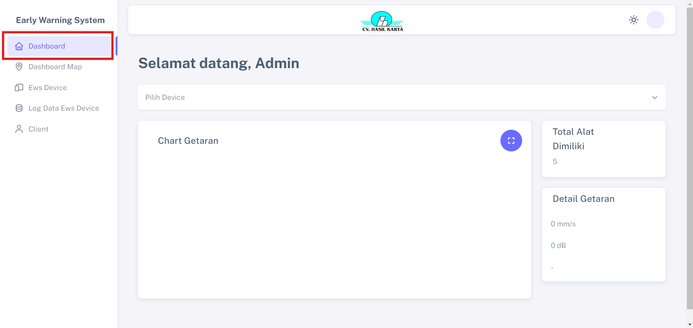
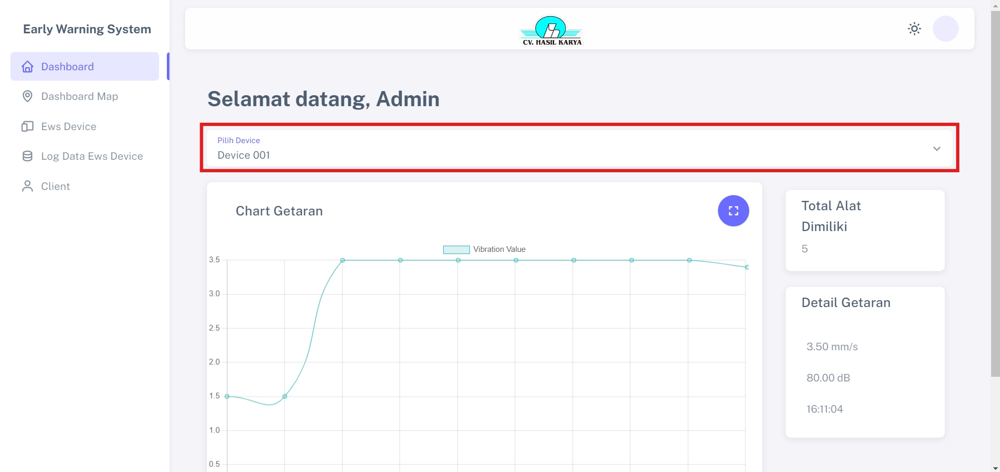

# Dashboard

Fitur "Dashboard" memberikan kemudahan pengguna untuk memilih perangkat dan melihat perkembangan data secara real-time dengan memperlihatkan grafik detail getaran dan total peralatan yang dimiliki.

## Langkah-langkah Melihat Perkembangan Device

1. Klik menu "Pilih Device" dan pilih device yang ingin dilihat

