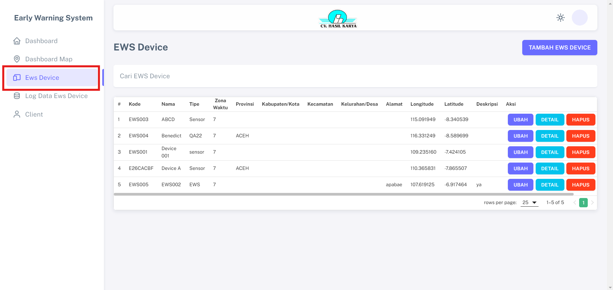
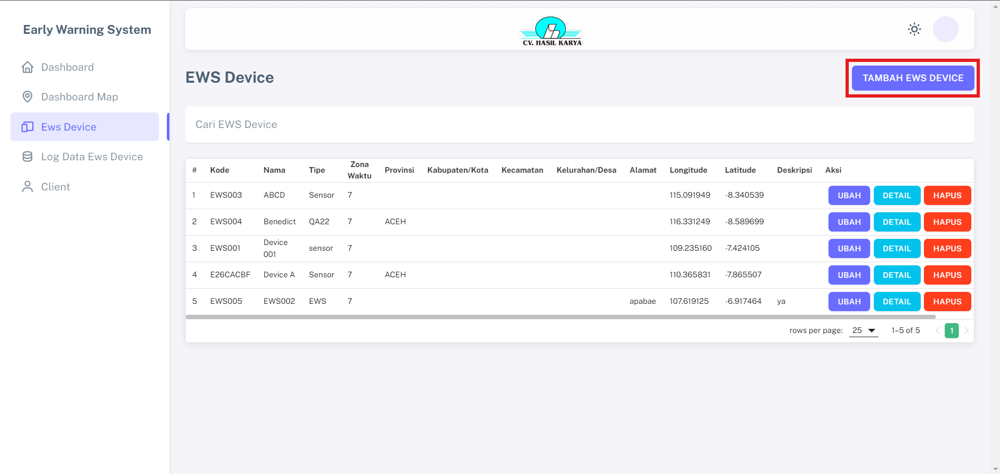

# Ews Device

Fitur "EWS Device" merupakan antarmuka yang menampilkan keseluruhan data dari setiap perangkat EWS (Early Warning System), yang memiliki identitas kode unik untuk setiap perangkat dan dilengkapi dengan spesifikasi yang komprehensif.

## Langkah-langkah Tambah Ews Device

1. Klik menu "TAMBAH EWS DEVICE" pada halaman dahsboard

2. Lengkapi semua data yang diperlukan dan simpan                 

