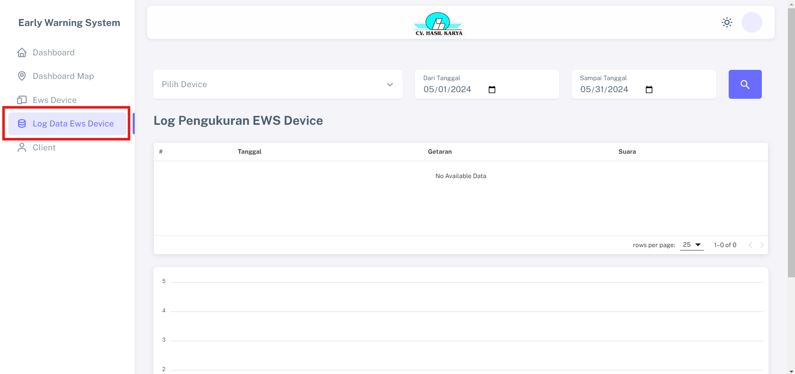
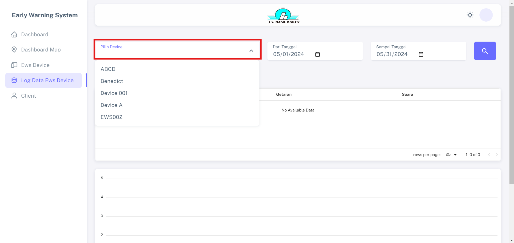

# Log Data Ews Device

Fitur "Log Data Ews Device" untuk memeriksa seluruh data log pengukuran berdasarkan perangkat dan tanggal yang dipilih pada log EWS Device dengan standar tampilan defaultnya rentang satu bulan.

## Langkah-langkah Mendapatkan Data Pengukuran

1. Klik menu "Pilih Device" dan pilih device yang ingin dilihat
