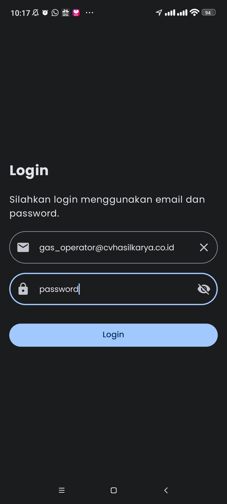
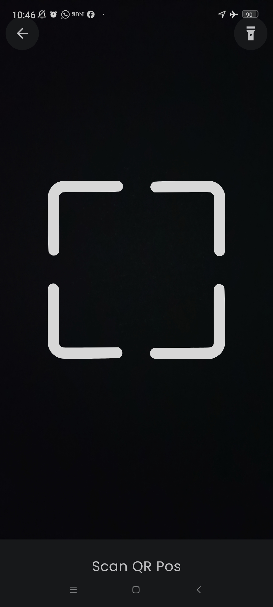
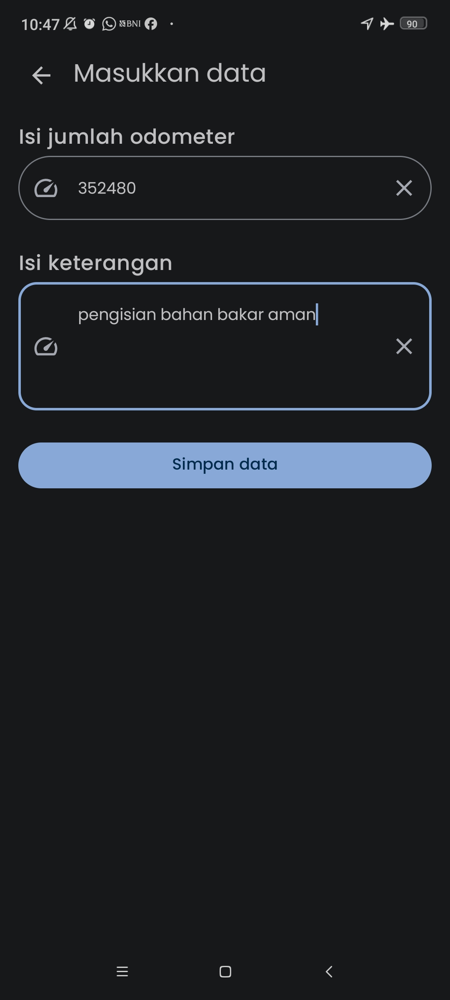
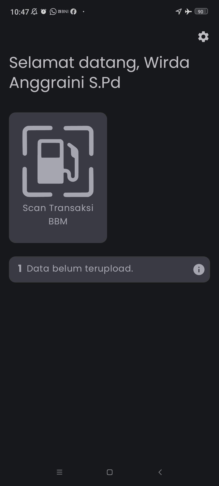
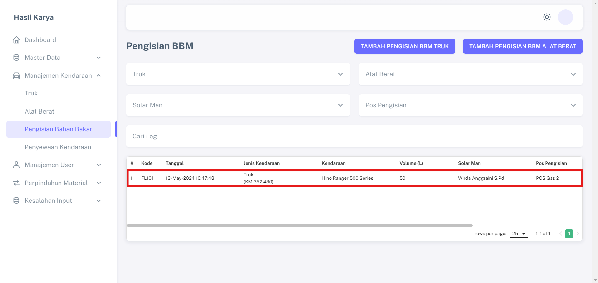
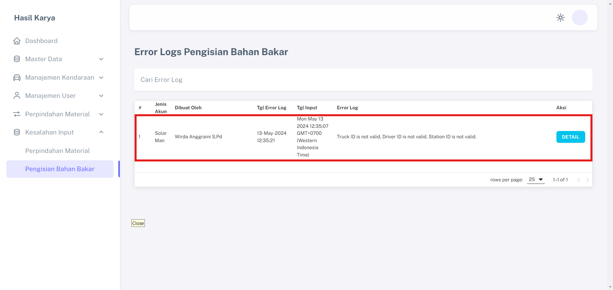

# Pencatatan BBM Kendaraan

Fitur "Pencatatan Bahan Bakar Minyak Kendaraan" memberikan kemudahan bagi proyek untuk mencatat penggunaan bahan bakar dengan tujuan meningkatkan transparansi. Fitur ini telah diintegrasikan dengan flowmeter yang menghasilkan QR Code mencakup volume bahan bakar yang telah digunakan.

## Data Yang Dibutuhkan
1. Data POS atau Station Pengisian Bahan Bakar
2. Data Truk atau Alat Berat
3. Data Driver
4. Data Solar Man atau Operator BBM

## Langkah-langkah Penggunaan

1. Solar Man login pada Aplikasi Android menggunakan akun yang terdaftar pada Aplikasi Sistem Hasil Karya.  

2. Klik menu "Scan Transaksi BBM" pada halaman dashboard.                                                                  

3. Klik salah satu menu yang ingin digunakan.    

4. Scan QR code yang terdapat pada truck atau alat berat sesuai menu yang dipilih.                 

5. Scan QR Code Driver truck atau alat berat sesuai menu yang dipilih.            

6. Scan QR Code Pos atau Station Solar Man.               

7. Scan QR Code Jumlah BBM yang dikeluarkan Flow Meter.              

8. Lengkapi semua data yang diperlukan dan simpan.                 

9. Jika Solar Man melakukan scan secara offline data tersimpan pada local storage android, dan otomatis tersinkronisasi pada website ketika handphone terkoneksi internet.         

10. Tampilan pada website setelah Solar Man berhasil memasukan data.   

11. Jika Solar Man melakukan kesalahan input maka data akan masuk pada menu "Error Logs Pengisian Bahan Bakar".

## FAQ (Frequently Asked Questions)
### Apakah saya perlu mencatat semua informasi?
Ya, pastikan untuk mengisi semua informasi yang diperlukan agar catatan BBM kendaraan Anda akurat.

### Apakah saya dapat mengedit catatan BBM yang sudah ada?
Ya, Anda dapat mengedit atau menghapus catatan BBM yang sudah ada sesuai kebutuhan.
