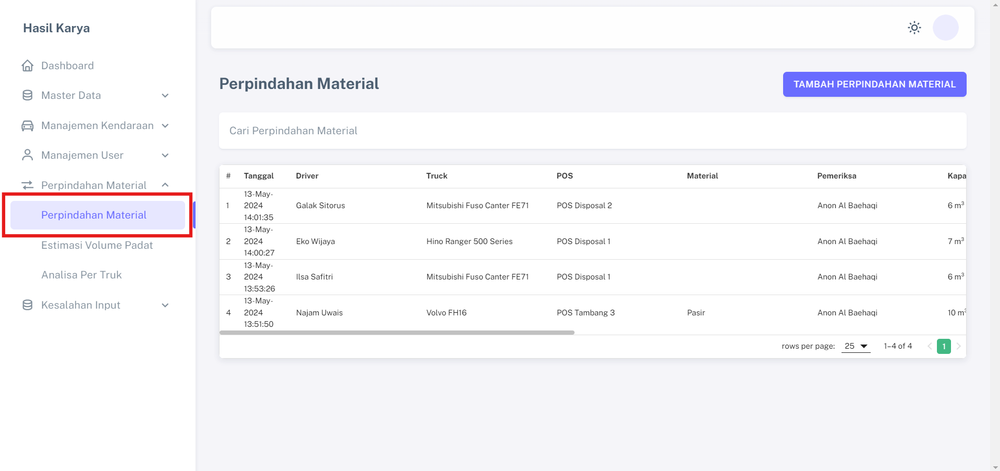
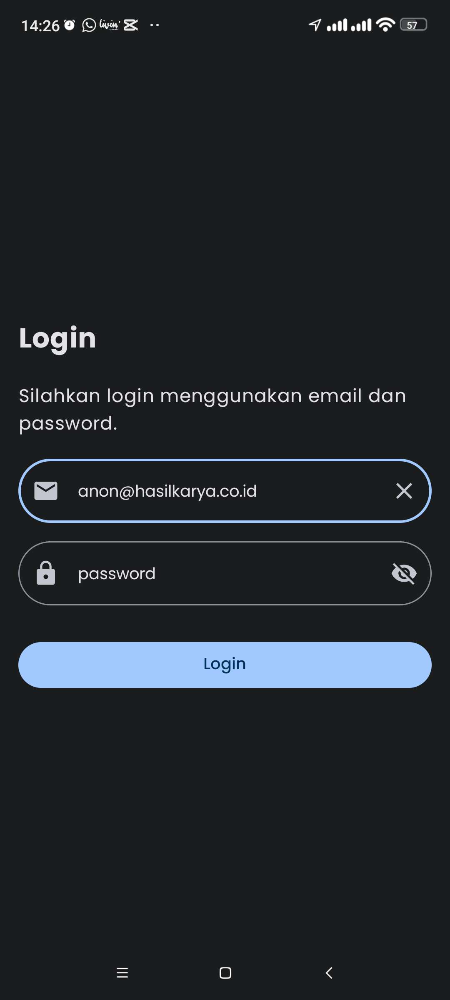
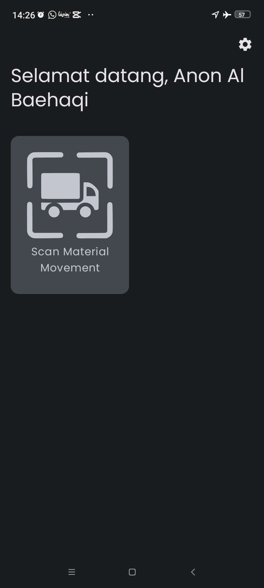
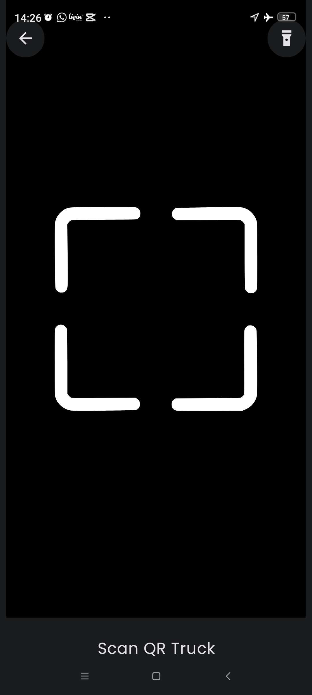
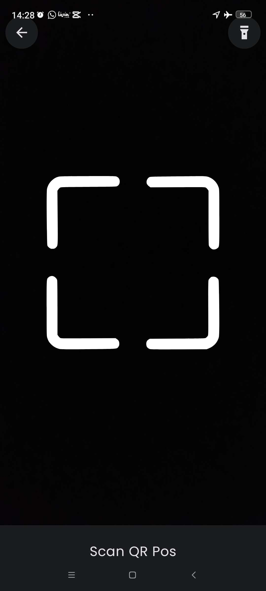
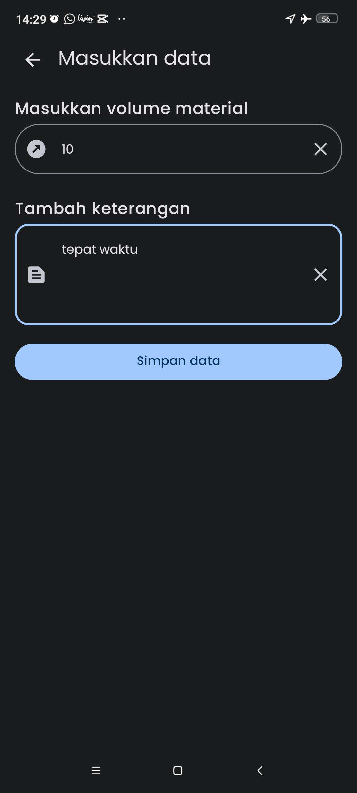
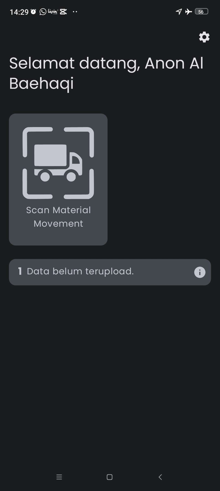
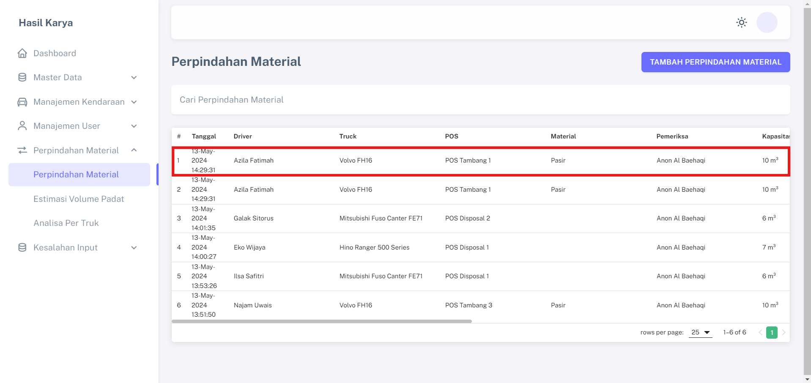
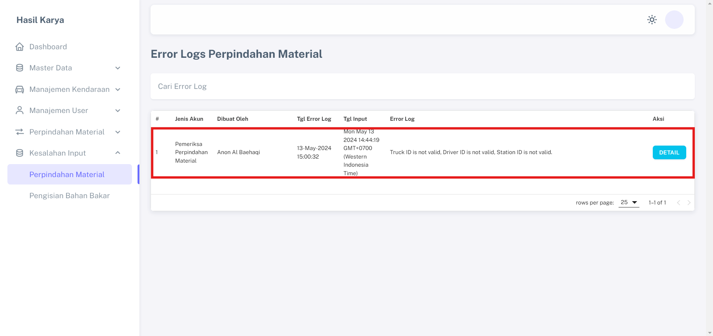

# Pencatatan Perpindahan Material

Fitur "Pencatatan Perpindahan Material" memberikan kemudahan bagi proyek untuk mencatat pergerakan material dari tambang ke lokasi proyek, dengan tujuan menjaga keamanan dan keakuratan data.

## Data Yang Dibutuhkan
1. Data POS 
2. Data Truk 
3. Data Driver
4. Data Checker

## Langkah-langkah Penggunaan

1. Checker login pada Aplikasi Android menggunakan akun yang terdaftar pada Aplikasi Sistem Hasil Karya.  

2. Klik menu "Scan Material Movement" pada halaman dashboard.                                                                  

4. Scan QR code yang terdapat pada truck.                  

5. Scan QR Code Driver truck.             

6. Scan QR Code Pos.                

7. Lengkapi semua data yang diperlukan dan simpan.                 

8. Jika Checker melakukan scan secara offline data tersimpan pada local storage android, dan otomatis tersinkronisasi pada website ketika handphone terkoneksi internet.         

9. Tampilan pada website setelah Checker berhasil memasukan data.   

10. Jika Checker melakukan kesalahan input maka data akan masuk pada menu "Error Logs Perpindahan Material".

