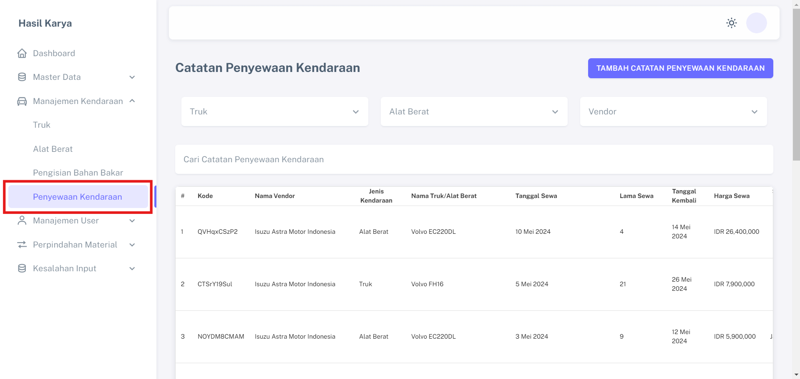
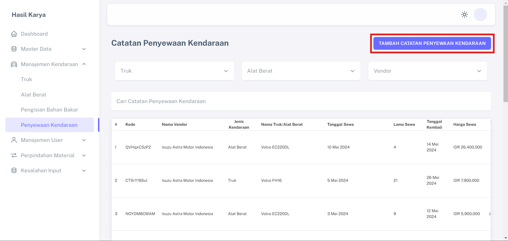
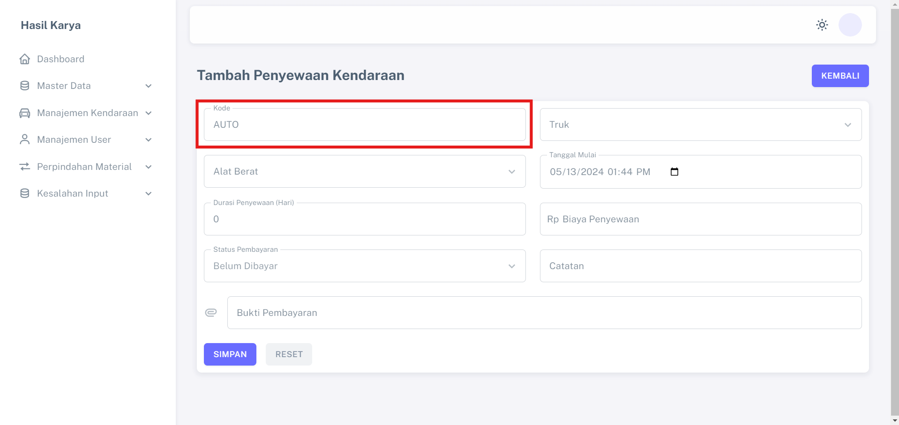
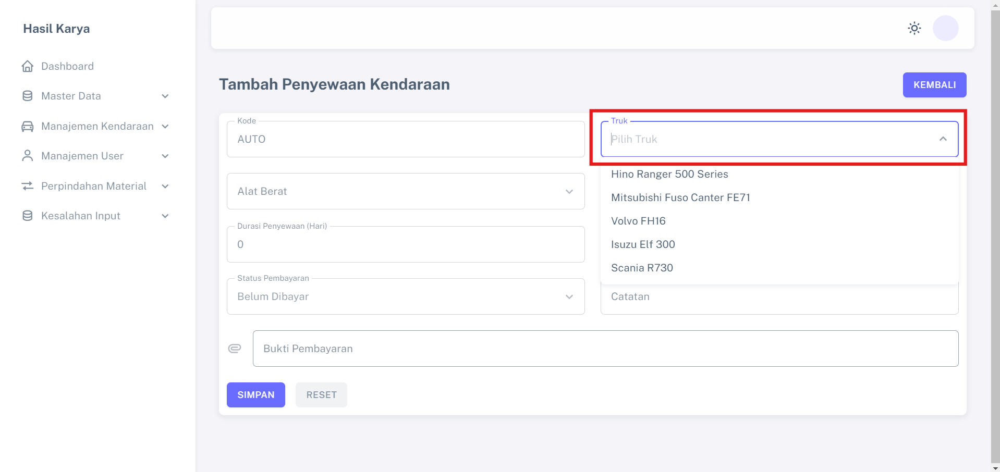
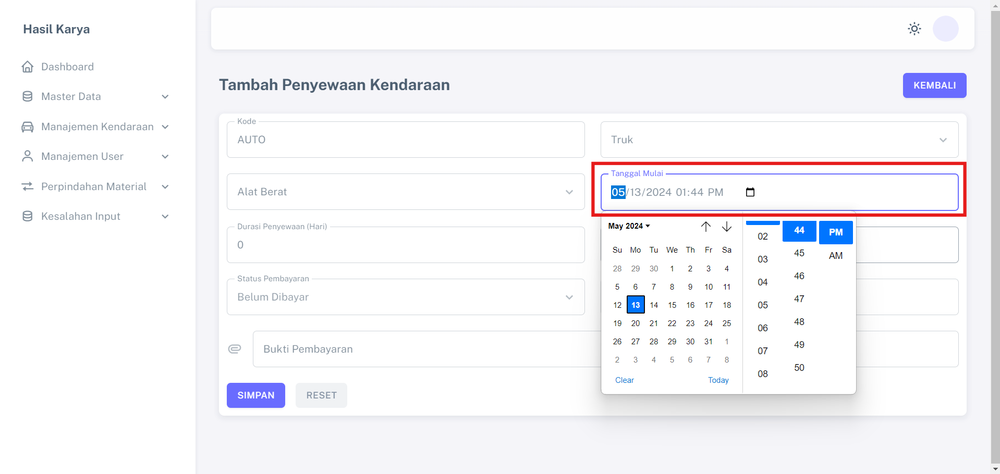
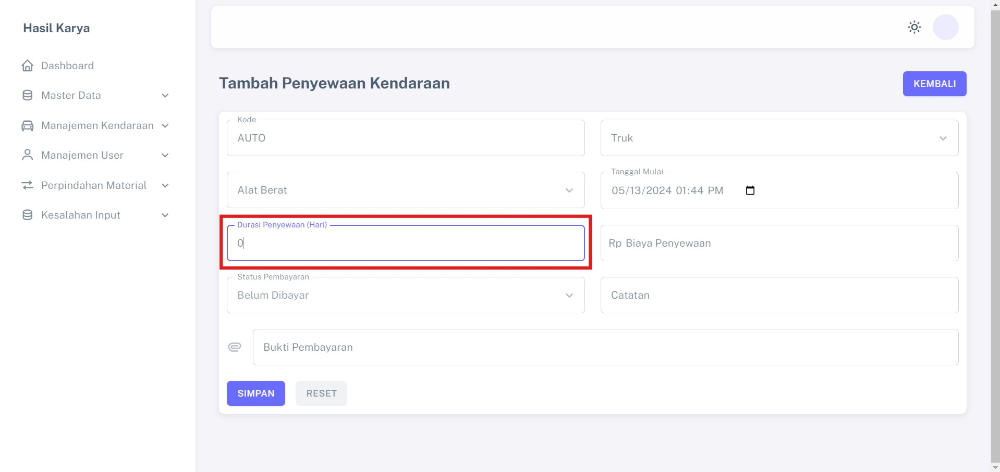
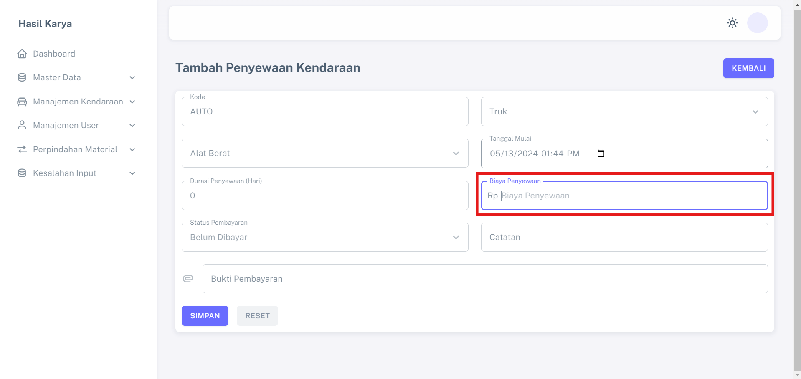
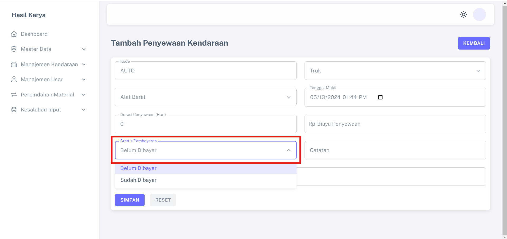
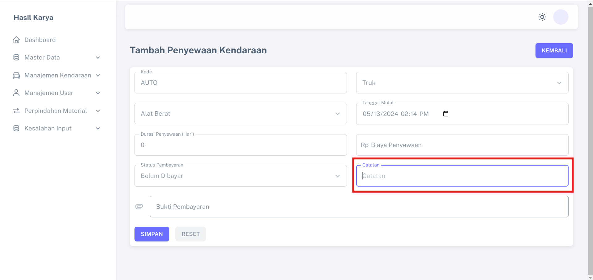
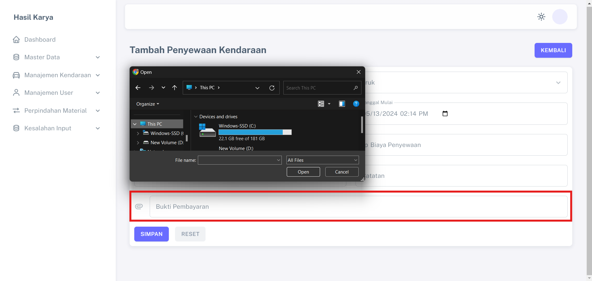

# Pencatatan Rental Kendaraan

Fitur "Pencatatan Rental Kendaraan" memberikan kemudahan bagi proyek untuk mencatat dan memantau penggunaan rental kendaraan, menjaga transparansi data dan memastikan pembayaran tepat waktu.

## Data Yang Dibutuhkan
1. Data Penerima Notifikasi
2. Data Truk atau Alat Berat

## Langkah-langkah Penggunaan

1. Klik menu "TAMBAH CATATAN PENYEWAAN KENDARAAN" pada halaman dashboard                                                                  

3. Pada inputan "Kode" dapat diisi secara otomatis atau menggunakan nomor nota atau invoice    

4. Klik pada salah satu jenis kendaraan                  

5. Pada inputan "Tanggal Mulai" diisi sesuai dengan nota atau invoice             

6. Pada inputan "Durasi Penyewaan (Hari)" diisi sesuai dengan nota dan jumlah satuan hari               

7. Pada inputan "Biaya Penyewaan" diisi hanya angka sesuai dengan nota               

8. Klik pada salah satu "Status Pembayaran" sesuai dengan kondisi                

9. Pada inputan "Catatan" bersifat opsional         

10. Klik pada inputan dan pilih foto nota atau invoice dan simpan   
