# Pengisian Data

Fitur "Master Data" memberikan kemudahan bagi proyek untuk menambahkan dan mengelola data-data utama, seperti penerima notifikasi, pelanggan, vendor, material, POS, dan proyek. Dengan adanya fitur ini, proyek dapat meningkatkan efisiensi dalam pengelolaan data, dan memastikan keakuratan informasi.

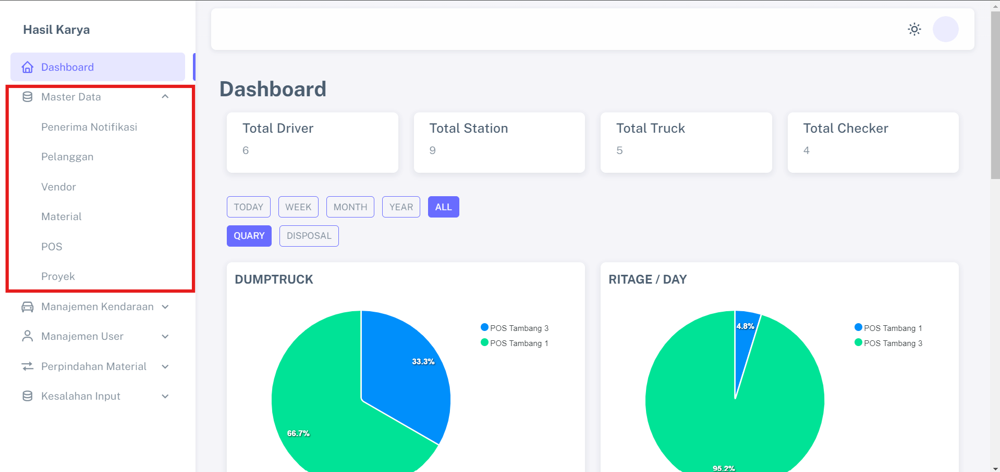

## Langkah-langkah Penerima Notifikasi

1. Klik menu "Penerima Notifikasi" pada Master Data, dan klik menu "TAMBAH PENERIMA NOTIFIKASI" pada halaman dashboard   
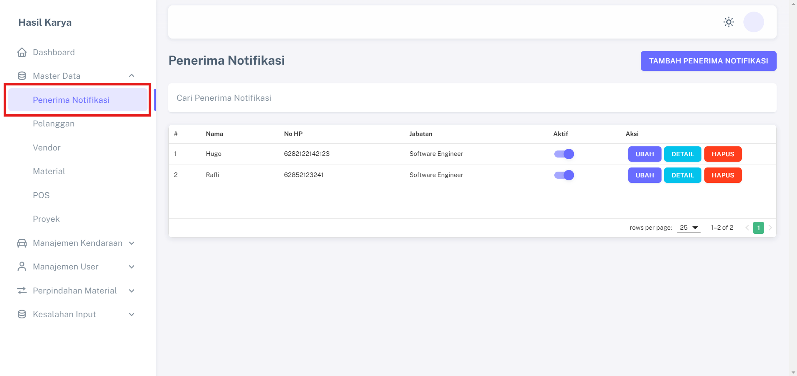

2. Lengkapi semua data yang diperlukan dan simpan                 
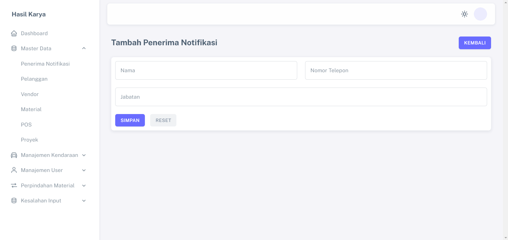

## Langkah-langkah Pelanggan

1. Klik menu "Pelanggan" pada Master Data, dan klik menu "TAMBAH CLIENT" pada halaman dashboard   
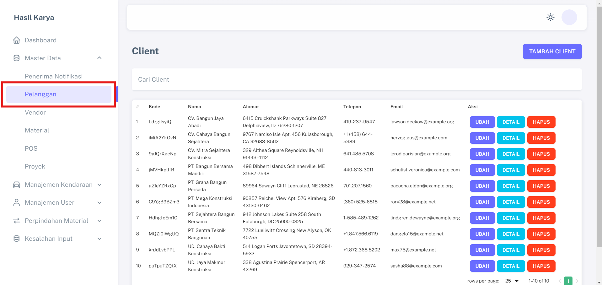

2. Lengkapi semua data yang diperlukan dan simpan                 
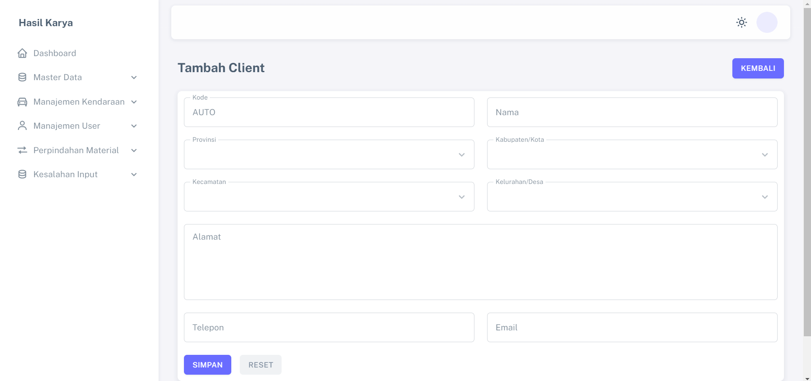

## Langkah-langkah Vendor

1. Klik menu "Vendor" pada Master Data, dan klik menu "TAMBAH VENDOR" pada halaman dashboard   
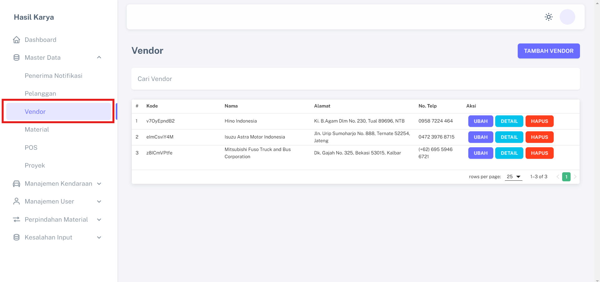

2. Lengkapi semua data yang diperlukan dan simpan                 

## Langkah-langkah Material

1. Klik menu "Material" pada Master Data, dan klik menu "TAMBAH MATERIAL" pada halaman dashboard   
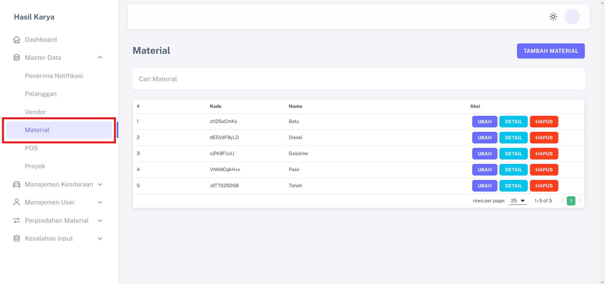

2. Lengkapi semua data yang diperlukan dan simpan                 

## Langkah-langkah POS

1. Klik menu "POS" pada Master Data, dan klik menu "TAMBAH STATION" pada halaman dashboard   
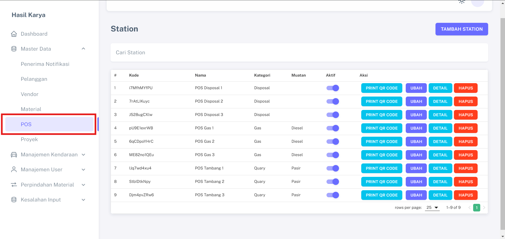

2. Lengkapi semua data yang diperlukan dan simpan                 
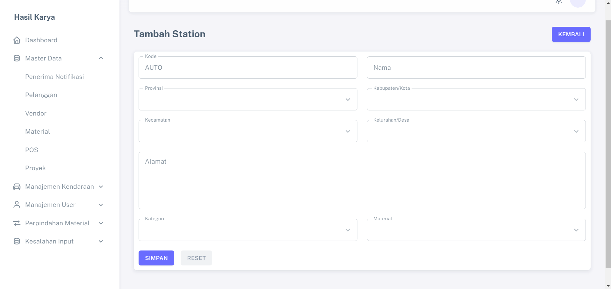

## Langkah-langkah Proyek

1. Klik menu "Proyek" pada Master Data, dan klik menu "TAMBAH PROYEK" pada halaman dashboard   
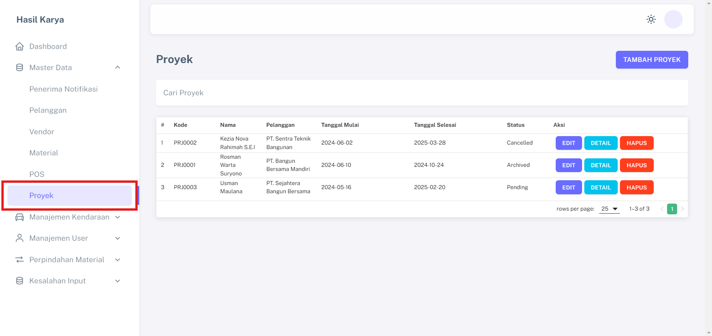

2. Lengkapi semua data yang diperlukan dan simpan                 
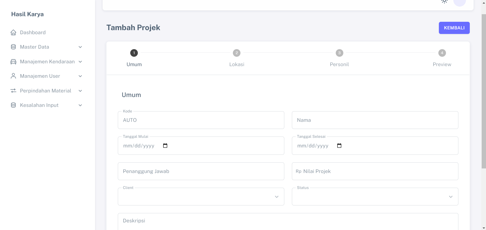